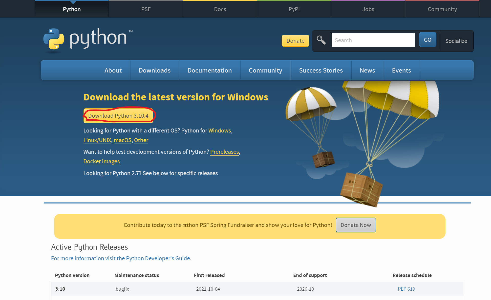
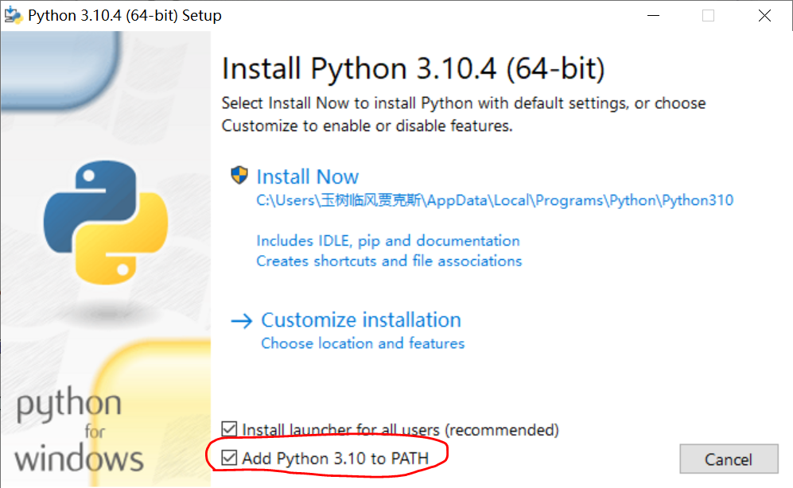
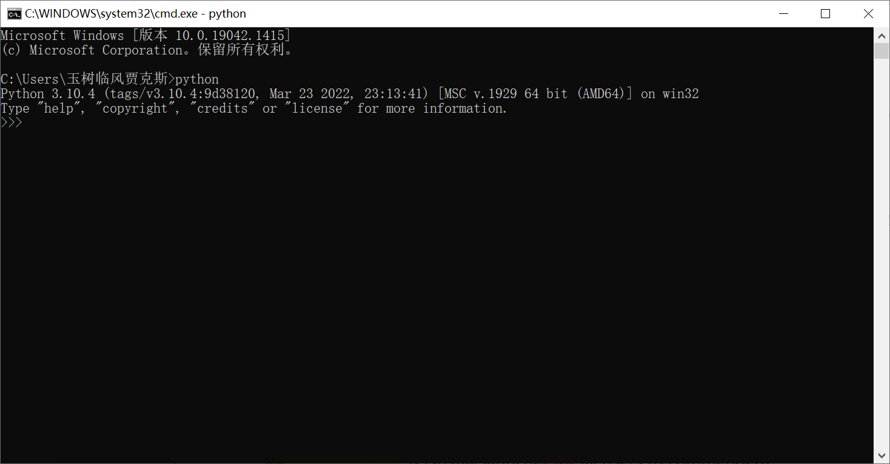

# Python 学习记录

> 参考：[Python官方文档](https://docs.python.org/ "Python 3.10 官方文档")
>
> 系统环境：Windows10
>
> 开发工具：VS Code
>
> Python版本：Python 3.10.4

## 1 写在前面

### 1.1 什么是Python？

Python是一门高级编程语言，是一门解释型编程语言。Python代码不需要编译和链接，不需要关注底层，可移植性高，通俗易懂，语法简单，容易上手。

### 1.2 为什么学习Python？

学习Python的理由，对于我来说，总结为以下几点：

- 对于重复性的工作，需要用Python脚本来帮助我完成自动化，提高效率；
- 进行数据分析；
- 结合其他编程语言一起，辅助完成项目。

**注意：本文档所写内容全部基于`.py`文件，并没有使用Python的终端。**

## 2 安装Python解释器

1. 找到Python的官方安装路径[Python官方下载地址](https://www.python.org/downloads/)，点击图中的下载按钮；

   

2. 打开下载好的安装文件，并将`Add Python 3.10.4 to PATH`勾上，这样子不用自己配环境变量；

   

3. 安装完成后，`win + R`打开命令给行，输入`python`查看是否安装成功，能看到版本说明已经安装成功了；

   

4. 为了在VS Code中使用Python，需要安装Python插件，在左侧插件一栏搜索`Python`，点击安装；

5. 使用快捷键`Ctrl + Shift + P`打开命令框，输入`Python Select Interpreter`，将Python的解释器路径添加进来，重启VS Code，在终端输入`python`，能开到版本说明VS Code的Python环境已经配置好，接下来就可以愉快地使用VS Code来写python代码了。

## 3 Python基础

### 3.1 注释

Python的注释是以`#`开始的一行文本，或者以`'''`或者`"""`包裹的多行文本。

```python
# 这是一个单行注释

'''
这是
一个
多行注释
'''

"""
这也是
一个
多行注释
"""
```

### 3.2 关键字

Python有自己的关键字，代码中一切命名都不能和关键字重名。由于版本不断更新，所以就不详细列出来所有的关键字，如果实在不确定自己的命名是不是和关键字冲突了，或者编辑器low到不能检测到这是一个关键字，那就使用`keyword`包的方法来判断。

```python
import keyword

print(keyword.iskeyword('keyword'))
```

### 3.3 基本运算

和其他编程语言一样，Python也有各种各样的运算。

1. 四则运算
2. 移位运算
3. 取模
4. 乘方


