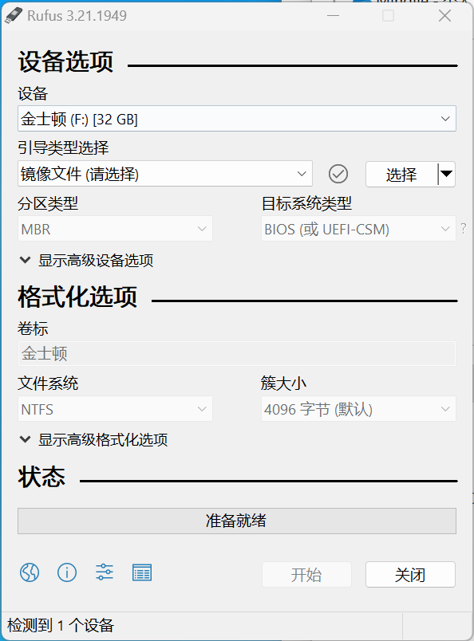
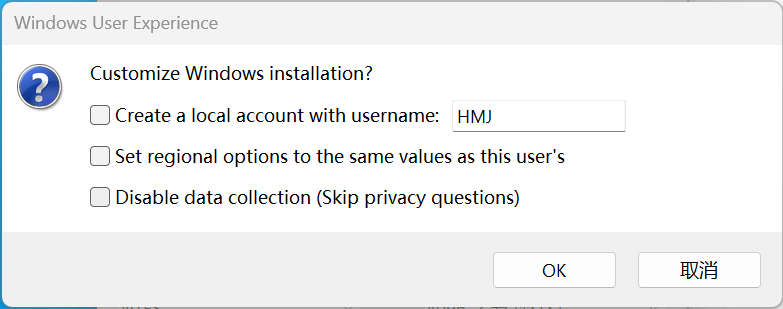
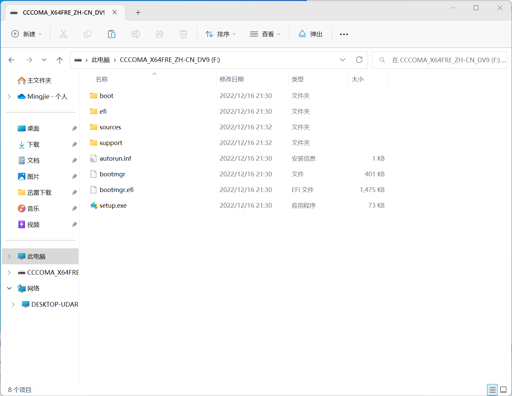

# windows镜像制作

> 镜像下载地址：https://msdn.itellyou.cn/
>
> 制作工具：rfus
>
> 工具地址：http://rufus.ie/zh/

**步骤：**

1. 启动rfus工具；

   

2. 点击“选择”，选中windows镜像；

3. 分区类型选择GPT；

4. 目标系统类型选择UEFI；

5. 点击“开始”；

6. 勾选定制选项，安装时更方便快捷；

   

7. 点击“OK”开始制作；

8. 弹出的警告选择“确定”；

9. 等待制作完成；

10. 制作完成后，如下图所示，就可以开始安装操作系统了。

    